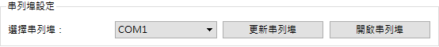
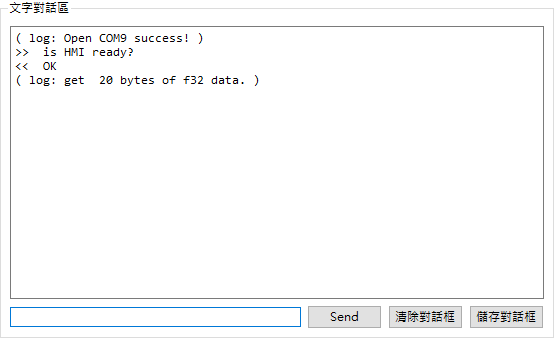
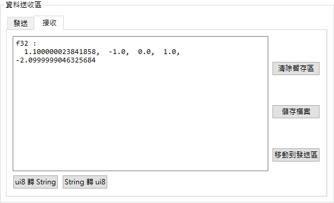
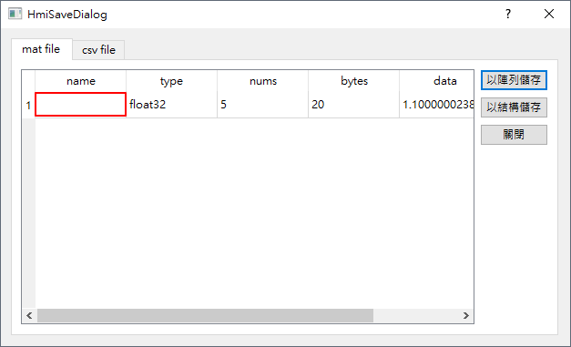
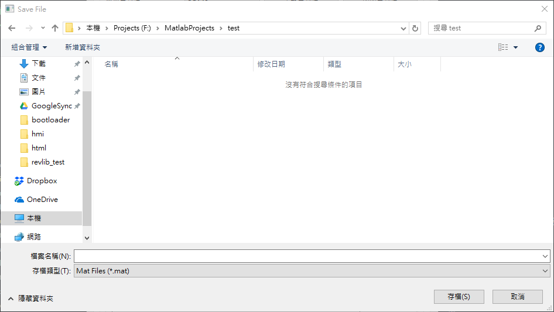
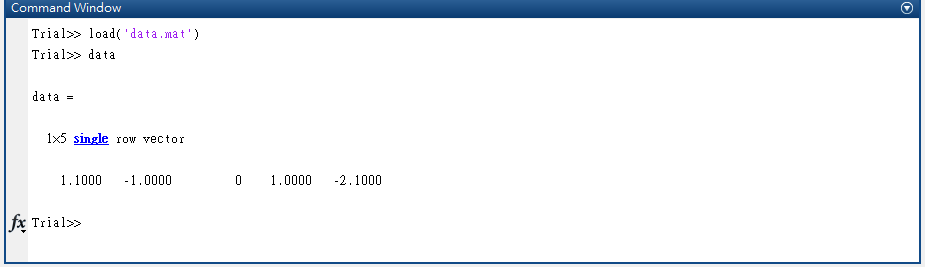

接收矩陣資料
=======================================

STEP 0. ASA_M128程式
```````````````````````````````````````

本區範例燒錄進ASA_M128之程式碼如下：

.. code-block:: c

    #include "ASA_Lib.h"

    #define HMI_TYPE_I8   0
    #define HMI_TYPE_I16  1
    #define HMI_TYPE_I32  2
    #define HMI_TYPE_I64  3
    #define HMI_TYPE_UI8  4
    #define HMI_TYPE_UI16 5
    #define HMI_TYPE_UI32 6
    #define HMI_TYPE_UI64 7
    #define HMI_TYPE_F32  8
    #define HMI_TYPE_F64  9

    int main() {
        ASA_M128_set();

        float data[5] = {1.1, -1, 0,1, -2.1};
        char s[20];
        char num = 5;

        int bytes = num*sizeof(float); // float is 4 bytes => bytes = 20
        // NOTE float and double both are 4 bytes (32 bits)
        // This is the only supported floating point format in AVR-GCC

        // 傳送文字給文字人機，並等待文字人機回覆OK，再進行矩陣資料傳送
        printf("is HMI ready?\n");
        scanf("%s", s); // wait for HMI response

        // 矩陣資料傳送
        M128_HMI_put(bytes, HMI_TYPE_F32, data); // send data

        return 0;
    }

SETP 1. 開啟串列埠、並執行程式
```````````````````````````````````````
在串埠設定區塊中之下拉選單選擇當前ASA_M128連接的串列埠，並點選開啟串列埠。

若下拉選單中無選項，請點選更新串列埠按鈕，以更新選單中串列埠。



將ASA_M128指撥開關撥到RUN模式。

按一下重置鍵RESET，讓ASA_M128開始執行程式。


SETP 2. 通知ASA_M128準備接收資料
```````````````````````````````````````
ASA_M128詢問文字人機是否準備好接收資料，在對話輸入框中輸入任意文字並發送，通知
ASA_M128可以發送資料給文字人機。

SETP 3. 接收矩陣資料
```````````````````````````````````````
回應後，ASA_M128將開始傳送矩陣資料，當ASA_M128執行
:code:`M128_HMI_put(bytes, HMI_TYPE_F32, data);` 後，
文字人機會在文字對話區接收頁面顯示紀錄，註明以接收到矩陣資料，如下圖



並可在資料送收區的接收頁面中看到成功接收的矩陣資料。



SETP 4. 儲存檔案
```````````````````````````````````````
文字人機可以將接燒到的資料轉存成MATLAB可以存取的格式。

在文字對話區接收頁面點擊儲存檔案按鈕，會顯示一個新的視窗，並顯示剛才在暫存區中資料。



雙擊"name"的欄位，並輸入想要取名的變數名稱，如下圖。
並點選以陣列儲存按鈕。

.. image:: _static/image/hmi/save_array_1.png

在儲存檔案視窗中選擇資料夾及輸入存檔名後點選存檔按鈕。




SETP 5. 以MATLAB開啟，並觀看
```````````````````````````````````````

