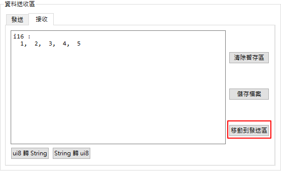
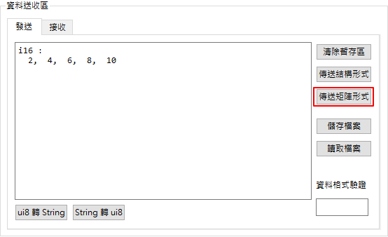
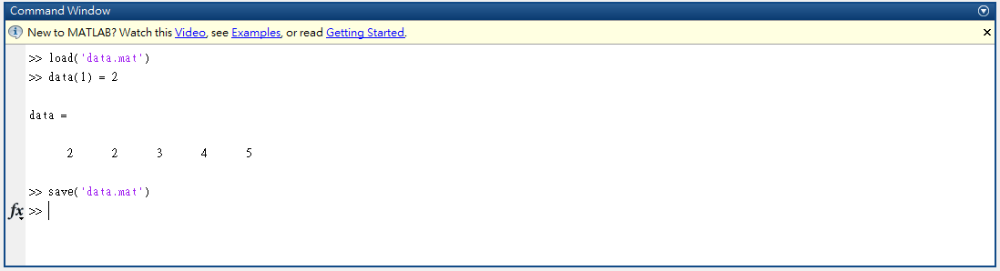
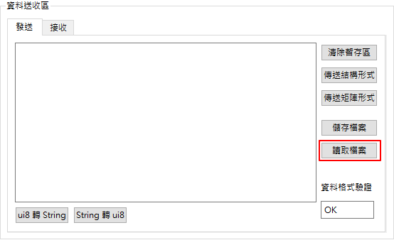
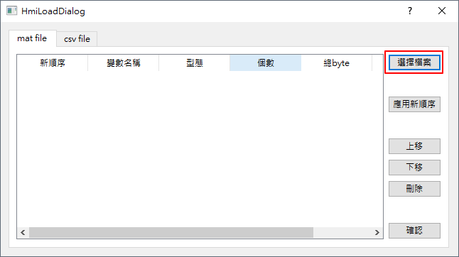
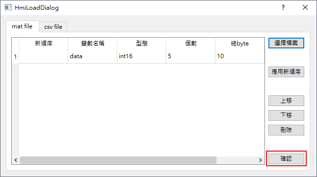
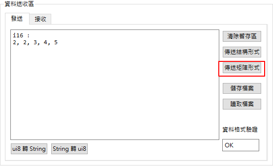
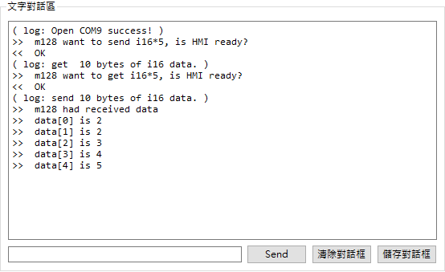

接收、修改、發送矩陣資料
=======================================

STEP 0. ASA_M128程式
```````````````````````````````````````
本區範例燒錄進ASA_M128之程式碼如下：

.. code-block:: c

    #include "ASA_Lib.h"

    #define HMI_TYPE_I8   0
    #define HMI_TYPE_I16  1
    #define HMI_TYPE_I32  2
    #define HMI_TYPE_I64  3
    #define HMI_TYPE_UI8  4
    #define HMI_TYPE_UI16 5
    #define HMI_TYPE_UI32 6
    #define HMI_TYPE_UI64 7
    #define HMI_TYPE_F32  8
    #define HMI_TYPE_F64  9

    int main() {
        ASA_M128_set();

        int data[5] = {1, 2, 3, 4, 5};
        int num = 5;
        char s[20];
        char res;

        int bytes = num*sizeof(int); // int is 4 bytes => bytes = 20

        printf("m128 want to send i16*5, is HMI ready?\n");
        scanf("%s", s);
        M128_HMI_put(bytes, HMI_TYPE_I16, data);

        printf("m128 want to get i16*5, is HMI ready?\n");
        scanf("%s", s);
        res = M128_HMI_get(bytes, data);

        if(res==0) {
            printf("m128 had received data\n");
            for (int i = 0; i < num; i++) {
                printf("data[%d] is %d\n", i, data[i]);
            }
        } else {
            printf("M128_HMI_get ERROR %d!\n", res);
        }

        return 0;
    }

SETP 1. 開啟串列埠、並執行程式
```````````````````````````````````````
略，請參考接收矩陣資料部分。

SETP 2. 通知ASA_M128準備接收資料
```````````````````````````````````````
略，請參考接收矩陣資料部分。

SETP 3. 接收矩陣資料
```````````````````````````````````````
略，請參考接收矩陣資料部分。

SETP 4. 準備發送資料
```````````````````````````````````````
文字人機提供暫存區以修改資料，也提供讀取mat檔案之功能以載入matlab儲存之資料。

方法一、暫存區修改資料

接收完資料後在接收頁面，點選"移動到發送區"按鈕。



切換到發送頁面，修改愈發送之數值。
在文字對話區傳送文字通知ASA_M128資料已準備好。
後點選"以矩陣形式傳送"按鈕，傳送矩陣資料給ASA_M28。



成功傳送後文字對話區會有log顯示已傳送資料。


方法二、MATLAB修改、讀取

先在MATLAB開啟剛才儲存之資料，並修改其中數值再儲存。



切換到發送頁面，點選"讀取檔案"之按鈕。



再讀取視窗中，點選"選擇檔案"按鈕。



點選"確認"按鈕，已載入資料。



SETP 5. 發送資料
```````````````````````````````````````
在文字對話區傳送文字通知ASA_M128資料已準備好。
後點選"以矩陣形式傳送"按鈕，傳送矩陣資料給ASA_M28。



成功傳送後文字對話區會有log顯示已傳送資料。


